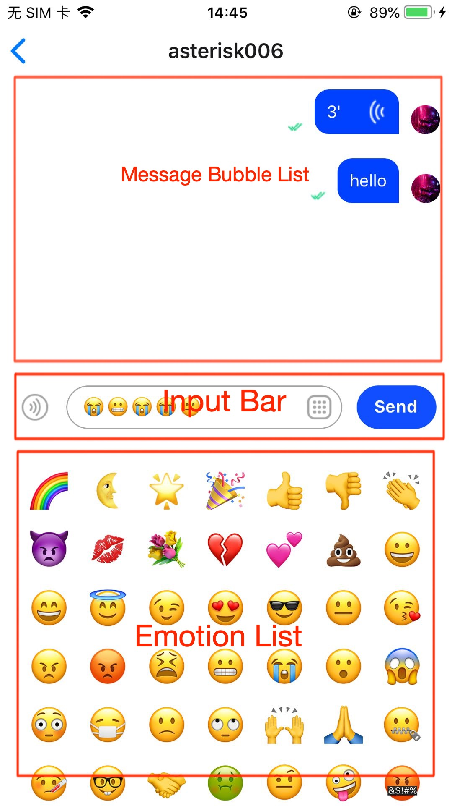

_English | [中文](./README.zh.md)_

---

# Quick-Start

Take you to quickly complete the compilation and operation of the project.

## Environmental Preparation

- operating system:
  - MacOS 10.15.7 or above
- Tools collection:
  - Xcode 13.4 or above (if developing iOS platform reference)
  - Android studio 2021.3.1 or above (if developing Android platform applications) (as for short)
  - Visual Studio Code latest (vscode for short)
- Compile and run environment:
  - Java JDK 1.8.0 or above (it is recommended to use Android studio's own)
  - Objective-C 2.0 or above (recommended to use Xcode comes with it)
  - Typescript 4.0 or above
  - Nodejs 16.18.0 or above (brew installation is recommended)
  - yarn 1.22.19 or above (brew installation is recommended)
  - React-Native 0.63.5 or above
  - npm and related tools (**not recommended**, please solve related problems by yourself)
  - expo 6.0.0 or above

## Source Code Download

[download link](https://github.com/easemob/react-native-chat-library/)

```sh
git clone git@github.com:easemob/react-native-chat-library.git
```

## Project Structure

This is a multi-package management project managed by `lerna` and `yarn workspace`.

- `example`: A relatively complete example project, used for demonstration and test development.
- `examples/uikit-example`: uikit example project (to be developed)
- `examples/callkit-example`: callkit example project, mainly for demonstration of `callkit sdk`.
- `packages/react-native-chat-uikit`: uikit project
- `packages/react-native-chat-callkit`: callkit project

**Note** The commands run by the project are generally in the project root directory, not the corresponding package directory or example directory.

## Compile and Run

#### Project Initialization

1. Use `vscode` to open the project `react-native-chat-library`
2. Use `terminal` to initialize the project `yarn`
3. If it is the first project initialization, you also need to execute the command `yarn run generate-source-env` to generate the corresponding files. For example: `env.ts`.

**Note** `yarn` will execute additional commands. For developers who don’t understand commands, if they need to use `npm` command instead, they need to understand more trustworthy content.
**Note** When creating this project, the scaffolding has preset some `yarn` related commands, so it is recommended to use `yarn` to complete most of the work.
**Note** Because `example` uses `firebase cloud message (fcm)` related content, if users need to use related content, they need to set the corresponding file (GoogleService-Info.plist is required for ios platform, google-services is required for android platform .json), if you don’t need it, just delete the relevant content.

#### Universal Compilation

The operation steps are as follows:

1. Use `terminal` to change directory to `example`
2. Execute the command `yarn run ios` to compile and run the `iOS` application
3. Execute the command `yarn run android` to compile and run the `Android` application

**NOTE** This mode is deprecated for compilation.
**Modify Command** Please refer to `example/package.json` related content.
**Reference** For more information on compiling and running commands, please refer to `expo` related content.

#### Universal Operation

Running an application in development mode requires additional local services, which can dynamically detect file source code modifications and perform dynamic debugging.

1. Using the `terminal` tool, switch to `cd example/ios`
2. Using the `terminal` tool, execute the `yarn run start` command to start the service.

#### iOS Platform

**<span style="color:orange">compile and build the project</span>**

In the compilation phase, the `iOS` platform needs to execute the `pod install` command to generate the Xcode `xcworkspace` project file.

1. Using the `terminal` tool, switch to `cd example/ios`
2. Use the `terminal` tool to execute `pod install` to generate `example/ios/example.xcworkspace`.
3. Use the `Xcode` tool to open the project file `example/ios/example.xcworkspace`
4. If you use the simulator, you need to choose `iOS` 12.4 or below
5. If you use a real device, the developer mode needs to be enabled on the real device, and `singing & capabilities` related content needs to be set in the project
6. Use the `Xcode` tool to execute the compile operation.

**Note** For developers who do not use `Xcode` to compile, they can use the official recommended method to compile. If there is a problem, it is generally difficult to find the cause of the problem.
**Note** The `react-native` native service is automatically started, not the `expo` service, and an error will be reported. Just turn off the service.

**<span style="color:orange">run the project</span>**

Use the command provided by the `expo` tool to start the local service, refer to the `General Operation` chapter.

**Note** If the running application is not loaded correctly, you need to refresh the page, or close the application and restart it. For error reporting problems, you can generally solve them through corresponding prompts.

#### Android Platform

**<span style="color:orange">compile and build the project</span>**

During the compilation phase, the `Android` platform needs to execute the `sync` initialization project.

1. Start the `android studio (referred to as as)` tool, open the project file `example/android`,
2. Click the `sync project with gradle files` button to execute the `initialization` operation,
3. If using an emulator, please select or create an emulator of version 6.0 or above,
4. If it is a real device, you need to enable the developer mode of the device,
5. When `sync` is successful, click the `run app` button to compile and run the project.

**Note** If you use `as` for the first time, it may take a lot of downloading and the waiting time will be longer.
**Note** `Android platform devices need data forwarding. The command for data forwarding is `adb reverse tcp:8081 tcp:8081`. Since `example`uses the`expo` tool, it does it for you, so no manual work is required.

**<span style="color:orange">run the project</span>**

Use the command provided by the `expo` tool to start the local service, refer to the `General Operation` chapter.

**Note** If the running application is not loaded correctly, you need to refresh the page, or close the application and restart it. For error reporting problems, you can generally solve them through corresponding prompts.
**Note** `Android platform devices need data forwarding. The command for data forwarding is `adb reverse tcp:8081 tcp:8081`. Since `example`uses the`expo` tool, it does it for you, so no manual work is required.

## Parameter Settings

After project initialization, a local configuration file of `env.ts` will be generated in the `example` project.

```typescript
export const test = false; // test mode or no
export const appKey = ''; // from register console
export const id = ''; // default user id
export const ps = ''; // default password or token
export const accountType = 'agora'; // 'easemob' or 'agora'
```

- `test`: When it is `true`, the page will switch to the simple component test mode, and the demonstration of the local component can be completed without performing remote operations such as login and logout. Defaults to `false`
- `appKey`: The unique identifier of the application, usually obtained through the background of the website
- `id`: The id of the logged-in user, usually obtained through registration or the background of the website
- `ps`: The secret key of the logged-in user, usually obtained through registration or the background of the website
- `accountType`: You can switch between domestic and foreign logins, the default is `agora`

---

# Integrate UIKIT In Existing Projects

There are several ways to use `uikit`:

1. Create a new project and integrate `uikit`. In this case, you need to pay attention to the development environment. Errors may be reported when compiling and running due to cross-version.
1. In the existing project, integrate `uikit`. In this case, you need to pay attention to the compatibility between the existing project version and the `uikit` project version, as well as the dependent version.
1. Modify the `example` project to complete product development. In this case, there are almost no development environment problems, but it is necessary to learn and understand the architectural thinking of `example` in order to better complete application development.

The following is the most common way, the introduction of integrating `uikit` in existing projects.

## Install `uikit` into an existing project

```sh
cd your_project_root
yarn add react-native-chat-uikit
```

For development, compilation, and operation, please refer to relevant chapters. The following uses the integrated chat page as an example to illustrate.

## Initialize settings

Before you are ready to use uikit, you need to initialize it. The modal component is used to receive events and display the modal window. Use default if default.

```typescript
import { GlobalContainer as UikitContainer } from 'react-native-chat-uikit';
import { ModalPlaceholder } from './events';
export default function App() {
  return (
    <React.StrictMode>
      <UikitContainer
        option={{
          appKey: appKey,
          autoLogin: autoLogin.current,
          debugModel: true,
        }}
        ModalComponent={() => <ModalPlaceholder />}
      />
    </React.StrictMode>
  );
}
```

**Description** The modal window management component needs to be set up during initialization. If this parameter is defaulted, the corresponding event notification may not be received.
**Description** Please refer to [Reference](./example/src/App.tsx) for actual use

## Quick Integration Chat Page

The chat page consists of several components. It mainly includes: message bubble list component and input component. The input component is composed of emoji component, voice component and extension component.


<!--  -->

{: width="100px" height="100px"}

## The Easiest Way To Integrate

1. In the entry method, complete the initialization of `uikit`
2. Use the `ChatFragment` component in the target page

Sample code:

```typescript
import * as React from 'react';
import { ChatFragment, ScreenContainer } from 'react-native-chat-uikit';
export default function ChatScreen(): JSX.Element {
  const chatId = 'xxx';
  const chatType = 0;
  return (
    <ScreenContainer mode="padding" edges={['right', 'left', 'bottom']}>
      <ChatFragment screenParams={{ chatId, chatType }} />
    </ScreenContainer>
  );
}
```

## Set Up A Personalized Chat Component

The chat component has many parameters and configurations, which can be set according to the needs to achieve the desired effect. For more advanced customization, please refer to the source code implementation.

#### The interface provided by the chat component

The chat component `ChatFragment` provides methods for sending all messages except command messages, and sending messages will be loaded to the chat bubble list page by default. Also provides a method to load historical messages.
If you want to use these methods, you need to set the `propsRef` parameter in the chat properties.

```typescript
export type ChatFragmentRef = {
  sendImageMessage: (
    params: {
      name: string;
      localPath: string;
      fileSize: string;
      imageType: string;
      width: number;
      height: number;
    }[]
  ) => void;
  sendVoiceMessage: (params: {
    localPath: string;
    fileSize?: number;
    duration?: number;
  }) => void;
  sendTextMessage: (params: { content: string }) => void;
  sendCustomMessage: (params: { data: CustomMessageItemType }) => void;
  sendFileMessage: (params: {
    localPath: string;
    fileSize?: number;
    displayName?: string;
  }) => void;
  sendVideoMessage: (params: {
    localPath: string;
    fileSize?: number;
    displayName?: string;
    duration: number;
    thumbnailLocalPath?: string;
    width?: number;
    height?: number;
  }) => void;
  sendLocationMessage: (params: {
    address: string;
    latitude: string;
    longitude: string;
  }) => void;
  loadHistoryMessage: (msgs: ChatMessage[]) => void;
};
```

#### The properties provided by the chat component

The chat component mainly provides common attributes. For example: set custom chat bubble list components, callbacks for various buttons or states.

```typescript
type ChatFragmentProps = {
  propsRef?: React.RefObject<ChatFragmentRef>;
  screenParams: {
    params: {
      chatId: string;
      chatType: number;
    };
  };
  messageBubbleList?: {
    MessageBubbleListP: React.ForwardRefExoticComponent<
      MessageBubbleListProps & React.RefAttributes<MessageBubbleListRef>
    >;
    MessageBubbleListPropsP: MessageBubbleListProps;
    MessageBubbleListRefP: React.RefObject<MessageBubbleListRef>;
  };
  customMessageBubble?: {
    CustomMessageRenderItemP: React.FunctionComponent<
      MessageItemType & { eventType: string; data: any }
    >;
  };
  onUpdateReadCount?: (unreadCount: number) => void;
  onClickMessageBubble?: (data: MessageItemType) => void;
  onLongPressMessageBubble?: (data: MessageItemType) => void;
  onClickInputMoreButton?: () => void;
  onPressInInputVoiceButton?: () => void;
  onPressOutInputVoiceButton?: () => void;
  onSendMessage?: (message: ChatMessage) => void;
  onSendMessageEnd?: (message: ChatMessage) => void;
  onVoiceRecordEnd?: (params: { localPath: string; duration: number }) => void;
};
```

#### The interface provided by the chat bubble list component

The chat bubble list component `MessageBubbleList` provides scrolling interface and loading message interface. Messages can be loaded directly by calling the `addMessage` method. Messages can also be added indirectly by manipulating the `ChatFragment` component.

```typescript
export type MessageBubbleListRef = {
  scrollToEnd: () => void;
  scrollToTop: () => void;
  addMessage: (params: {
    msgs: MessageItemType[];
    direction: InsertDirectionType;
  }) => void;
  updateMessageState: (params: {
    localMsgId: string;
    result: boolean;
    reason?: any;
    item?: MessageItemType;
  }) => void;
};
```

#### The properties provided by the chat bubble list component

The chat bubble list component mainly displays messages. Currently, it provides a custom message bubble style, and a pull-down refresh request history message callback. Default style is used if not provided. Currently only text, image, and voice provide default styles.

```typescript
export type MessageBubbleListProps = {
  onRequestHistoryMessage?: (params: { earliestId: string }) => void;
  TextMessageItem?: ListRenderItem<TextMessageItemType>;
  ImageMessageItem?: ListRenderItem<ImageMessageItemType>;
  VoiceMessageItem?: ListRenderItem<VoiceMessageItemType>;
  FileMessageItem?: ListRenderItem<FileMessageItemType>;
  LocationMessageItem?: ListRenderItem<LocationMessageItemType>;
  VideoMessageItem?: ListRenderItem<VideoMessageItemType>;
  CustomMessageItem?: ListRenderItem<CustomMessageItemType>;
};
```

#### Chat Properties: Controller

`propsRef` This property is mainly used to actively call related methods of `ChatFragment`.

**Knowledge points** For `React-Native` technical framework, UI components generally provide several ways to determine component behavior.

1. Use attributes to initialize or dynamically update component styles
2. Use attribute callbacks to notify upper-level users of status changes
3. Use controllers (ref) to control the active behavior of subcomponents

Example: After recording a voice, send a voice message

```typescript
export default function ChatScreen(): JSX.Element {
  const chatId = 'xxx';
  const chatType = 0;
  return (
    <ScreenContainer mode="padding" edges={['right', 'left', 'bottom']}>
      <ChatFragment
        screenParams={{ chatId, chatType }}
        onVoiceRecordEnd={(params) => {
          chatRef.current.sendVoiceMessage(params);
        }}
      />
    </ScreenContainer>
  );
}
```

For example: After selecting a picture, send a picture message

```typescript
import type { BizEventType, DataActionEventType } from '../events';
import { DataEventType } from 'react-native-chat-uikit';
export default function ChatScreen(): JSX.Element {
  const chatId = 'xxx';
  const chatType = 0;
  React.useEffect(() => {
    const sub = DeviceEventEmitter.addListener(
      'DataEvent' as DataEventType,
      (event) => {
        const { action } = event as {
          eventBizType: BizEventType;
          action: DataActionEventType;
          senderId: string;
          params: any;
          timestamp?: number;
        };
        switch (action) {
          case 'chat_open_media_library':
            Services.ms
              .openMediaLibrary({ selectionLimit: 1 })
              .then((result) => {
                chatRef.current?.sendImageMessage(result as any);
              })
              .catch((error) => {
                console.warn('error:', error);
              });
            break;

          default:
            break;
        }
      }
    );
    return () => {
      sub.remove();
    };
  }, [addListeners]);
  return (
    <ScreenContainer mode="padding" edges={['right', 'left', 'bottom']}>
      <ChatFragment screenParams={{ chatId, chatType }} />
    </ScreenContainer>
  );
}
```

#### Chat property: chat bubble list component

When the default chat bubble cannot meet the custom requirements, you can design the style of the chat bubble yourself.

Suppose `MessageBubbleList` is a custom chat bubble list component.

```typescript
import type { MessageBubbleListProps } from '../fragments/MessageBubbleList';
import MessageBubbleList from '../fragments/MessageBubbleList';
export default function ChatScreen(): JSX.Element {
  const chatId = 'xxx';
  const chatType = 0;
  return (
    <ScreenContainer mode="padding" edges={['right', 'left', 'bottom']}>
      <ChatFragment
        screenParams={{ chatId, chatType }}
        messageBubbleList={{
          MessageBubbleListP: MessageBubbleListFragment,
          MessageBubbleListPropsP: {
            TextMessageItem: MyTextMessageBubble,
            VideoMessageItem: MyVideoMessageBubble,
            FileMessageItem: MyFileMessageBubble,
          } as MessageBubbleListProps,
          MessageBubbleListRefP: messageBubbleListRefP as any,
        }}
      />
    </ScreenContainer>
  );
}
```

**Description** Since `MessageBubbleList` implements too many source codes, please refer to it if necessary [here](https://github.com/easemob/react-native-chat-library/tree/dev/example/src/components/CustomMessageBubble.tsx)

#### Chat Properties: Unread Count Notifications

```typescript
export default function ChatScreen(): JSX.Element {
  const chatId = 'xxx';
  const chatType = 0;
  return (
    <ScreenContainer mode="padding" edges={['right', 'left', 'bottom']}>
      <ChatFragment
        screenParams={{ chatId, chatType }}
        onUpdateReadCount={(unreadCount: number) => {
          // TODO: Broadcast no reading notification.
        }}
      />
    </ScreenContainer>
  );
}
```

#### Chat properties: click on the chat bubble notification

Typical applications: playing voice messages, displaying picture previews.

```typescript
export default function ChatScreen(): JSX.Element {
  const chatId = 'xxx';
  const chatType = 0;
  return (
    <ScreenContainer mode="padding" edges={['right', 'left', 'bottom']}>
      <ChatFragment
        screenParams={{ chatId, chatType }}
        onClickMessageBubble={(data: MessageItemType) => {
          // TODO: If it is a voice message, it plays it, if it is a picture message, it previews it.
        }}
      />
    </ScreenContainer>
  );
}
```

#### Chat properties: Long press the message bubble notification

```typescript
export default function ChatScreen(): JSX.Element {
  const chatId = 'xxx';
  const chatType = 0;
  return (
    <ScreenContainer mode="padding" edges={['right', 'left', 'bottom']}>
      <ChatFragment
        screenParams={{ chatId, chatType }}
        onLongPressMessageBubble={() => {
          // TODO: Displays the context menu. For example, message forwarding, message deletion, message resending, etc.
        }}
      />
    </ScreenContainer>
  );
}
```

#### Chat Properties: Notify on click of extension button

Typical application: display message context menu, and perform operations such as message forwarding and message cancellation.

```typescript
export default function ChatScreen(): JSX.Element {
  const chatId = 'xxx';
  const chatType = 0;
  return (
    <ScreenContainer mode="padding" edges={['right', 'left', 'bottom']}>
      <ChatFragment
        screenParams={{ chatId, chatType }}
        onClickInputMoreButton={() => {
          // TODO: Open drawer menu, pop up list, for example: open media library, open document library, etc.
        }}
      />
    </ScreenContainer>
  );
}
```

#### Chat Properties: Press the voice button notification

```typescript
export default function ChatScreen(): JSX.Element {
  const chatId = 'xxx';
  const chatType = 0;
  return (
    <ScreenContainer mode="padding" edges={['right', 'left', 'bottom']}>
      <ChatFragment
        screenParams={{ chatId, chatType }}
        onPressInInputVoiceButton={() => {
          // TODO: The voice recording starts.
        }}
      />
    </ScreenContainer>
  );
}
```

#### Chat properties: Raise the voice button notification

```typescript
export default function ChatScreen(): JSX.Element {
  const chatId = 'xxx';
  const chatType = 0;
  return (
    <ScreenContainer mode="padding" edges={['right', 'left', 'bottom']}>
      <ChatFragment
        screenParams={{ chatId, chatType }}
        onPressOutInputVoiceButton={() => {
          // TODO: The voice recording stops.
        }}
      />
    </ScreenContainer>
  );
}
```

#### Chat property: send message notification

```typescript
export default function ChatScreen(): JSX.Element {
  const chatId = 'xxx';
  const chatType = 0;
  return (
    <ScreenContainer mode="padding" edges={['right', 'left', 'bottom']}>
      <ChatFragment
        screenParams={{ chatId, chatType }}
        onSendMessage={(message: ChatMessage) => {
          // TODO: Update the message.
        }}
      />
    </ScreenContainer>
  );
}
```

#### Chat property: send message completion notification

```typescript
export default function ChatScreen(): JSX.Element {
  const chatId = 'xxx';
  const chatType = 0;
  return (
    <ScreenContainer mode="padding" edges={['right', 'left', 'bottom']}>
      <ChatFragment
        screenParams={{ chatId, chatType }}
        onSendMessageEnd={(message: ChatMessage) => {
          // TODO: Update message status, success or failure.
        }}
      />
    </ScreenContainer>
  );
}
```

#### Chat property: voice recording end notification

```typescript
export default function ChatScreen(): JSX.Element {
  const chatId = 'xxx';
  const chatType = 0;
  return (
    <ScreenContainer mode="padding" edges={['right', 'left', 'bottom']}>
      <ChatFragment
        screenParams={{ chatId, chatType }}
        onVoiceRecordEnd={(params: any) => {
          // TODO: Voice files are processed and voice messages are sent.
        }}
      />
    </ScreenContainer>
  );
}
```

## Quick integration session list

The easiest way to integrate `ConversationListFragment`:

```typescript
import * as React from 'react';
import {
  ConversationListFragment,
  ScreenContainer,
} from 'react-native-chat-uikit';
export default function ChatScreen(): JSX.Element {
  const chatId = 'xxx';
  const chatType = 0;
  return (
    <ScreenContainer mode="padding" edges={['right', 'left', 'bottom']}>
      <ConversationListFragment />
    </ScreenContainer>
  );
}
```

### The methods provided by the session list

The session component provides methods for creating, updating, reading, and extending attributes.

```typescript
export type ConversationListFragmentRef = {
  update: (message: ChatMessage) => void;
  create: (params: { convId: string; convType: ChatConversationType }) => void;
  updateRead: (params: {
    convId: string;
    convType: ChatConversationType;
  }) => void;
  updateExtension: (params: {
    convId: string;
    convType: ChatConversationType;
    ext?: any; // json object.
  }) => void;
};
```

### Attributes provided by the session list

The session list provides attributes of click, long press, unread count, sorting strategy, and custom style.

```typescript
export type ConversationListFragmentProps = {
  propsRef?: React.RefObject<ConversationListFragmentRef>;
  onLongPress?: (data?: ItemDataType) => void;
  onPress?: (data?: ItemDataType) => void;
  onData?: (data: ItemDataType[]) => void;
  onUpdateReadCount?: (unreadCount: number) => void;
  sortPolicy?: (a: ItemDataType, b: ItemDataType) => number;
  RenderItem?: ItemComponent;
  /**
   * If `RenderItem` is a custom component and uses side-slip mode, you need to inform the width of the side-slide component.
   */
  RenderItemExtraWidth?: number;
};
```

#### Set up a personalized session list

#### Session list attribute: click callback

Click on the conversation list item, typical application: enter the chat page.

```typescript
export default function ChatScreen(): JSX.Element {
  const chatId = 'xxx';
  const chatType = 0;
  return (
    <ScreenContainer mode="padding" edges={['right', 'left', 'bottom']}>
      <ConversationListFragment
        onPress={(data?: ItemDataType) => {
          // todo: enter to chat detail screen.
        }}
      />
    </ScreenContainer>
  );
}
```

#### Session list attribute: long press callback

Long press the chat list item, typical application: display the context menu.

```typescript
export default function ChatScreen(): JSX.Element {
  const chatId = 'xxx';
  const chatType = 0;
  return (
    <ScreenContainer mode="padding" edges={['right', 'left', 'bottom']}>
      <ConversationListFragment
        onLongPress={(data?: ItemDataType) => {
          // todo: show context menu.
        }}
      />
    </ScreenContainer>
  );
}
```

#### session list attribute: update unread count callback

```typescript
export default function ChatScreen(): JSX.Element {
  const chatId = 'xxx';
  const chatType = 0;
  return (
    <ScreenContainer mode="padding" edges={['right', 'left', 'bottom']}>
      <ConversationListFragment
        onUpdateReadCount={(unreadCount: number) => {
          // todo: show unread message count.
        }}
      />
    </ScreenContainer>
  );
}
```

#### Session list attribute: sorting strategy

The default sorting is to sort `convId`, you can set it yourself if you want. Typical application: session sticking to the top.

```typescript
export default function ChatScreen(): JSX.Element {
  const chatId = 'xxx';
  const chatType = 0;
  return (
    <ScreenContainer mode="padding" edges={['right', 'left', 'bottom']}>
      <ConversationListFragment
        sortPolicy={(a: ItemDataType, b: ItemDataType) => {
          if (a.key > b.key) {
            return 1;
          } else if (a.key < b.key) {
            return -1;
          } else {
            return 0;
          }
        }}
      />
    </ScreenContainer>
  );
}
```

#### Session List Properties: Custom Styles

The display style of the session list items can be customized.
**Note** If you activate the side sliding function, you need to set the width of the side sliding component.

```typescript
export default function ChatScreen(): JSX.Element {
  const chatId = 'xxx';
  const chatType = 0;
  return (
    <ScreenContainer mode="padding" edges={['right', 'left', 'bottom']}>
      <ConversationListFragment
        RenderItem={(props) => {
          return <View />;
        }}
      />
    </ScreenContainer>
  );
}
```

---

# Q & A

If you have more questions, please check here, and if you have more suggestions, please contribute here.

[skip to here](./QA.md)

---

# mind Mapping

The description of this dimension may increase your understanding of the project.

[skip to here](./swdt.md)
