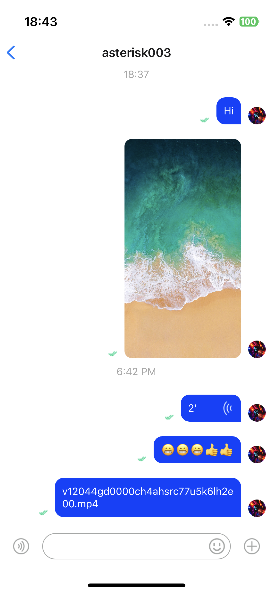

# Introduction

With Agora Chat UIKit for React Native, you can easily build an in-app chat with all the essential messaging features.

UIKit for React Native is available for you to build and customize views at a component level.

UiKit provides basic components and advanced fragment components. Base components are used by fragment components. Fragment components provide methods, properties, and callback notifications. You can actively call methods through ref, change styles through attributes, and receive notifications through callbacks. To learn more about our development kits, please visit the following pages.

# Quick Start

**Target: Send your first message.**

We'll take the easiest way to build the chat app you want. The chat application page can be built mainly using the components `UikitContainer` and `ChatFragment`.



## Environment Requirements

The recommended version of React-Native is:

- react-native: 0.63.5 or later
- nodejs: 16.18.0 or later

## Create Project

```sh
npx react-native init ChatApp
```

## Install UIKit and the required dependencies

```sh
yarn add react-native-chat-uikit
```

## Permission Requirements

On iOS platform:

add permission properties in `ios/example/Info.plist` file.

```xml
<dict>
  <key>NSCameraUsageDescription</key>
  <string></string>
  <key>NSMicrophoneUsageDescription</key>
  <string></string>
  <key>NSPhotoLibraryUsageDescription</key>
</dict>
```

On Android platform:

add permission properties in `android/app/src/main/AndroidManifest.xml` file.

```xml
<manifest xmlns:android="http://schemas.android.com/apk/res/android" package="com.hyphenate.rn.example">
  <uses-permission android:name="android.permission.INTERNET"/>
  <uses-permission android:name="android.permission.READ_EXTERNAL_STORAGE"/>
  <uses-permission android:name="android.permission.SYSTEM_ALERT_WINDOW"/>
  <uses-permission android:name="android.permission.VIBRATE"/>
  <uses-permission android:name="android.permission.WRITE_EXTERNAL_STORAGE"/>
  <uses-permission android:name="android.permission.CAMERA" />
  <uses-permission android:name="android.permission.RECORD_AUDIO" />
</manifest>
```

## CodingSource Code Implementation

Initialize the UiKit SDK. Fill in the necessary parameters. For example: appkey.

```typescript
import {
  GlobalContainer as UikitContainer,
  UikitModalPlaceholder,
} from 'react-native-chat-uikit';
export default function App() {
  return (
    <React.StrictMode>
      <UikitContainer
        option={{
          appKey: appKey,
          autoLogin: autoLogin.current,
          debugModel: true,
        }}
        ModalComponent={() => <UikitModalPlaceholder />}
      />
    </React.StrictMode>
  );
}
```

Add the ChatFragment component. This component includes an input component and a message display component.

```typescript
import * as React from 'react';
import { ChatFragment, ScreenContainer } from 'react-native-chat-uikit';
export default function ChatScreen(): JSX.Element {
  const chatId = 'xxx'; // The Chat ID. It can be a person or a group.
  const chatType = 0; // 0 means single person chat. 1 means group chat.
  return (
    <ScreenContainer mode="padding" edges={['right', 'left', 'bottom']}>
      <ChatFragment screenParams={{ chatId, chatType }} />
    </ScreenContainer>
  );
}
```

If you need to view the complete code or run it, you can download the project and try it locally. [portal](https://github.com/AgoraIO-Usecase/AgoraChat-UIKit-rn)

# UiKit Detail

## Download UiKit SDK && Examples

```sh
git clone git@github.com:AgoraIO-Usecase/AgoraChat-rn.git
```

## Repo Environment Requirements

- operating system:
  - MacOS 10.15.7 or above
- Tools collection:
  - Xcode 13.4 or above (if developing iOS platform reference)
  - Android studio 2021.3.1 or above (if developing Android platform applications) (as for short)
  - Visual Studio Code latest (vscode for short)
- Compile and run environment:
  - Java JDK 1.8.0 or above (it is recommended to use Android studio's own)
  - Objective-C 2.0 or above (recommended to use Xcode comes with it)
  - Typescript 4.0 or above
  - Nodejs 16.18.0 or above (brew installation is recommended)
  - yarn 1.22.19 or above (brew installation is recommended)
  - React-Native 0.63.5 or above
  - npm and related tools (**not recommended**, please solve related problems by yourself)
  - expo 6.0.0 or above

## Initialize the project.

```sh
yarn && yarn run example-env && yarn run sdk-version
```

## Fragment Components

UiKit SDK fragment components usually consists of three parts. Method, property and callback notifications. The method part is called through the `propRef` object and can be executed actively. For example: let the child component get focus. Properties can change the style of a component and affect its behavior. Callback notifications can receive component state changes.

UiKit SDK mainly includes the following fragment components:

<table>
  <tr>
    <td>Module</td>
    <td>Function</td>
    <td>Description</td>
  </tr>
  <tr>
    <td rowspan="5" style="font-weight: bold">Conversation List</td>
  </tr>
  <tr>
    <td>Conversation list</td>
    <td style="font-size: 15px">
      Presents the conversation information, including the user's avatar and nickname, content of the last message, unread message count, and the time when the last message is sent or received.
    </td>
  </tr>
  <tr>
    <td>Add conversation</td>
    <td style="font-size: 15px">
      Adds the conversation to the conversation list
    </td>
  </tr>
  <tr>
    <td>Update conversation</td>
    <td style="font-size: 15px">
      Updates the conversation in the conversation list
    </td>
  </tr>
  <tr>
    <td>Delete conversation</td>
    <td style="font-size: 15px">
      Deletes the conversation from the conversation list
    </td>
  </tr>
  <tr>
    <td rowspan="5" style="font-weight: bold">Chat</td>
  </tr>
  <tr>
    <td>Message Bubble</td>
    <td style="font-size: 15px">
      Provides built-in bubble styles for messages of some types and support custom 
      message bubble styles. 
    </td>
  </tr>
  <tr>
    <td>Send Message</td>
    <td style="font-size: 15px">Supports message sending.</td>
  </tr>
  <tr>
    <td>Message Bubble Event</td>
    <td style="font-size: 15px">
      Supports events for clicking and holding down message bubbles.
    </td>
  </tr>
  <tr>
    <td>emoji</td>
    <td style="font-size: 15px">Support ink emojis with Unicode codes.</td>
  </tr>
</table>

## Conversation List Fragment Component

The methods it provides include:

- update: Updates the conversation list item.
- create: Creates a conversation list item.
- remove: Removes a conversation list item.
- updateRead: Sets the conversation as read.
- updateExtension: Sets conversation custom fields.

The properties and callback notifications it provides include:

- propsRef: Sets the conversation list controller.
- onLongPress: Occurs when a conversation list item is held down.
- onPress: Occurs upon a click on a conversation list item.
- onUpdateReadCount: Occurs when a conversation list item is updated.
- sortPolicy: Sets the rules of sorting out conversation list items.
- RenderItem: Customizes the style of the conversation list items.

## Chat Detail Fragment Component

The methods it provides include:

- sendTextMessage: Sends a text message.
- sendImageMessage: Sends an image message.
- sendVoiceMessage: Sends a voice message.
- sendCustomMessage: Sends a custom message.
- sendFileMessage: Sends a file message.
- sendVideoMessage: Sends a video message.
- sendLocationMessage: Sends a location message.
- loadHistoryMessage: Loads historical messages.
- deleteLocalMessage: Deletes local messages.
- resendMessage: Resend a message that fails to be sent.
- downloadAttachment: Downloads a message attachment.

The properties and callback notifications it provides include:

- propsRef: Sets the chat component controller.
- screenParams: Sets the parameters of the chat component.
- messageBubbleList: Set the custom message bubble component.
- onUpdateReadCount: Occurs when the count of unread messages is updated.
- onClickMessageBubble: Occurs upon a click on the message bubble notification
- onLongPressMessageBubble: Occurs when a message bubble is held down.
- onClickInputMoreButton: Occurs when the More button is pressed.
- onPressInInputVoiceButton: Occurs when the voice button is pressed.
- onPressOutInputVoiceButton: Occurs when the voice button is released.
- onSendMessage: Occurs when the message starts to be sent.
- onSendMessageEnd: Occurs when the message sending is complete.
- onVoiceRecordEnd: Occurs when the recording of a voice message is complete.

**SubComponent chat message bubble component:**

The methods it provides include:

- scrollToEnd: Scrolls to the bottom of the page.
- scrollToTop: Scrolls to the top of the page.
- addMessage: Adds a message.
- updateMessageState: Updates the message state.
- delMessage: Deletes a message bubble item.
- resendMessage: Resend a message.

The properties and callback notifications it provides include:

- onRequestHistoryMessage: pull down to refresh request history message notification
- TextMessageItem: Customizes the style of text messages.
- ImageMessageItem: Customizes the style of image messages.
- VoiceMessageItem: Customizes the style of voice messages.
- FileMessageItem: Customizes the style of file messages.
- LocationMessageItem: Customizes the style of location messages.
- VideoMessageItem: Customizes the style of video messages.
- CustomMessageItem: Customizes the style of custom messages.

## Other components

Other components are in the experimental stage. If you are interested, you can try to use them.

- Basic UI components: Provide basic styles and usage. [Reference](../../packages/react-native-chat-uikit/src/components).
- Internationalization tools: Provides UI language settings. [Reference](../../packages/react-native-chat-uikit/src/I18n2).
- Modal component management tool: Provides unified display and hiding of modal windows. [Reference](../../packages/react-native-chat-uikit/src/events/index.tsx)
- Tool class: Provide necessary functions. [Reference](../../packages/react-native-chat-uikit/src/utils)
- Pasteboard service: Provides copy and paste services.
- Persistent storage service: Provides key-value service.
- Media service: Provides services like opening the media library and selecting pictures, videos, and files.
- Permission service: Provides services for applying for iOS or Android platform permissions.
- File service: Provides folder management service.

## Others

If you are interested in the source code, you can view it here. [portal](https://github.com/AgoraIO-Usecase/AgoraChat-rn/tree/dev/packages/react-native-chat-uikit)

If there is a better improvement, you are welcome to submit a pull request.

## License

MIT
