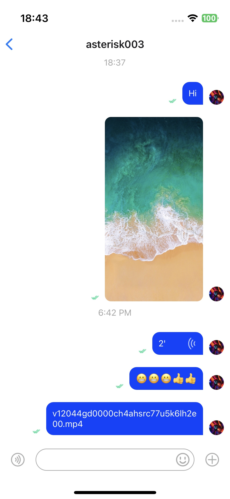

# react-native-chat-uikit

## Overview

Agora Chat UIKit for React-Native is a development kit with an user interface that enables an easy and fast integration of standard chat features into new or existing client apps. The Agora Chat UIKit SDK is designed on the basis of the Agora Chat SDK. It provides UI components to achieve efficient application development. Also it encapsulates necessary modules of the Agora Chat SDK and some basic tools to facilitate application development.

Agora Chat UiKit provides basic components and advanced fragment components. Base components are used by fragment components. Fragment components provide methods, properties, and callback notifications. Fragment components are developed around the chat business, which is more suitable for quickly building chat applications.

UIKit SDK mainly includes the following fragment components:

<table>
  <tr>
    <td>Module</td>
    <td>Methods And Properties</td>
    <td>Description</td>
  </tr>
  <tr>
    <td rowspan="7" style="font-weight: bold">Conversation List</td>
  </tr>
  <tr>
    <td>Conversation list</td>
    <td style="font-size: 15px">
      Presents the conversation information, including the user's avatar and nickname, content of the last message, unread message count, and the time when the last message is sent or received. Support custom session list item style, support custom side menu.
    </td>
  </tr>
  <tr>
    <td>Add conversation</td>
    <td style="font-size: 15px">
      Adds the conversation to the conversation list. Typical application scenario: Receive a new message and open a new session.
    </td>
  </tr>
  <tr>
    <td>Update conversation</td>
    <td style="font-size: 15px">
      Updates the conversation in the conversation list.
    </td>
  </tr>
  <tr>
    <td>Delete conversation</td>
    <td style="font-size: 15px">
      Deletes the conversation from the conversation list.
    </td>
  </tr>
  <tr>
    <td>Update conversation read count</td>
    <td style="font-size: 15px">
      All messages for this conversation have been read.
    </td>
  </tr>
  <tr>
    <td>Update conversation extension attribute</td>
    <td style="font-size: 15px">
      Update session custom attributes. Typical application scenario: conversation do not disturb.
    </td>
  </tr>
  <tr>
    <td rowspan="5" style="font-weight: bold">Chat</td>
  </tr>
  <tr>
    <td>Message Bubble List</td>
    <td style="font-size: 15px">
      Provides built-in bubble styles for messages of some types and support custom message bubble styles. Support message bubble click event, long press event operation. Support message bubble adding, updating and deleting.
    </td>
  </tr>
  <tr>
    <td>Send Message</td>
    <td style="font-size: 15px">Supports sending various types of messages. Update message delivery status. Supports sending notifications before and after a message is sent.</td>
  </tr>
  <tr>
    <td>emoji</td>
    <td style="font-size: 15px">Supports the display, sending and receiving of emoji expressions.</td>
  </tr>
  <tr>
    <td>Input Bar</td>
    <td style="font-size: 15px">Supports text and expression input, voice recording, and customizable more menus.</td>
  </tr>
</table>

**See the [parent document](./../../README.md) for details on the project development environment, repository download address, configuration information and configuration files.**

## Important features

- Conversation List
- Chatting in a conversation
- Message bubble List in a conversation

## Integrate UIKit Into Your Project.

#### Create Your Project

```sh
npx react-native init ChatApp
```

#### Install UIKit and the required dependencies

```sh
yarn add react-native-chat-uikit
```

#### Permission Requirements

On iOS platform:

add permission properties in `ios/example/Info.plist` file.

```xml
<dict>
  <key>NSCameraUsageDescription</key>
  <string></string>
  <key>NSMicrophoneUsageDescription</key>
  <string></string>
  <key>NSPhotoLibraryUsageDescription</key>
</dict>
```

On Android platform:

add permission properties in `android/app/src/main/AndroidManifest.xml` file.

```xml
<manifest xmlns:android="http://schemas.android.com/apk/res/android" package="com.hyphenate.rn.example">
  <uses-permission android:name="android.permission.INTERNET"/>
  <uses-permission android:name="android.permission.READ_EXTERNAL_STORAGE"/>
  <uses-permission android:name="android.permission.SYSTEM_ALERT_WINDOW"/>
  <uses-permission android:name="android.permission.VIBRATE"/>
  <uses-permission android:name="android.permission.WRITE_EXTERNAL_STORAGE"/>
  <uses-permission android:name="android.permission.CAMERA" />
  <uses-permission android:name="android.permission.RECORD_AUDIO" />
</manifest>
```

#### Implement Application Code

Minimize integration. If you need to log in, please add additional information or refer to the demo.

```typescript
import {
  ChatFragment,
  GlobalContainer as UikitContainer,
  UikitModalPlaceholder,
} from 'react-native-chat-uikit';
export default function App() {
  const appKey = '<your app key>';
  const chatId = '<peer target ID>'; // The Chat ID. It can be a person or a group.
  const chatType = 0; // 0 means single person chat. 1 means group chat.
  return (
    <UikitContainer
      option={{ appKey: appKey }}
      ModalComponent={() => <UikitModalPlaceholder />}
    >
      <ChatFragment screenParams={{ chatId, chatType }} />
    </UikitContainer>
  );
}
```



If you want to experience it quickly, you can refer to this project.
[UIKit Quick Start Demo](https://github.com/AgoraIO-Usecase/AgoraChat-UIKit-rn)

## UIKit Instructions

### Conversation List Fragment Component

The conversation list component supports updating, adding, deleting session records, style modification, status changes, etc.

The methods it provides include:

- update: Updates the conversation list item.
- create: Creates a conversation list item.
- remove: Removes a conversation list item.
- updateRead: Sets the conversation as read.
- updateExtension: Sets conversation custom fields.

The properties and callback notifications it provides include:

- propsRef: Sets the conversation list controller.
- onLongPress: Occurs when a conversation list item is held down.
- onPress: Occurs upon a click on a conversation list item.
- onUpdateReadCount: Occurs when a conversation list item is updated.
- sortPolicy: Sets the rules of sorting out conversation list items.
- RenderItem: Customizes the style of the conversation list items.

The simplest integration example is as follows:

```typescript
import * as React from 'react';
import {
  ConversationListFragment,
  ScreenContainer,
} from 'react-native-chat-uikit';
export default function ChatScreen(): JSX.Element {
  const chatId = 'xxx';
  const chatType = 0;
  return (
    <ScreenContainer mode="padding" edges={['right', 'left', 'bottom']}>
      <ConversationListFragment />
    </ScreenContainer>
  );
}
```

Typical scenario: You can click on the conversation list item to enter the chat details page. If you need to customize it, you can pay attention to this callback notification.

```typescript
export default function ChatScreen(): JSX.Element {
  const chatId = 'xxx';
  const chatType = 0;
  return (
    <ScreenContainer mode="padding" edges={['right', 'left', 'bottom']}>
      <ConversationListFragment
        onPress={(data?: ItemDataType) => {
          // todo: enter to chat detail screen.
        }}
      />
    </ScreenContainer>
  );
}
```

Typical scenario: You can long-press a session list item to display the context menu for that item. If you need to customize it, you can pay attention to this callback notification.

```typescript
export default function ChatScreen(): JSX.Element {
  const chatId = 'xxx';
  const chatType = 0;
  return (
    <ScreenContainer mode="padding" edges={['right', 'left', 'bottom']}>
      <ConversationListFragment
        onLongPress={(data?: ItemDataType) => {
          // todo: show context menu.
        }}
      />
    </ScreenContainer>
  );
}
```

Typical scenario: Many components need to pay attention to the unread notification to change the status of the message reminder. Follow the callback notification if needed.

```typescript
export default function ChatScreen(): JSX.Element {
  const chatId = 'xxx';
  const chatType = 0;
  return (
    <ScreenContainer mode="padding" edges={['right', 'left', 'bottom']}>
      <ConversationListFragment
        onUpdateReadCount={(unreadCount: number) => {
          // todo: show unread message count.
        }}
      />
    </ScreenContainer>
  );
}
```

Typical scenario: The default sorting is to sort `convId`, you can set it yourself if you want. Typical application: session sticking to the top.

```typescript
export default function ChatScreen(): JSX.Element {
  const chatId = 'xxx';
  const chatType = 0;
  return (
    <ScreenContainer mode="padding" edges={['right', 'left', 'bottom']}>
      <ConversationListFragment
        sortPolicy={(a: ItemDataType, b: ItemDataType) => {
          if (a.key > b.key) {
            return 1;
          } else if (a.key < b.key) {
            return -1;
          } else {
            return 0;
          }
        }}
      />
    </ScreenContainer>
  );
}
```

Typical scenario: Customize the style of session list items. For example, message top status and second interruption status can be displayed in a customized way.
**Note** If you activate the side sliding function, you need to set the width of the side sliding component.

```typescript
export default function ChatScreen(): JSX.Element {
  const chatId = 'xxx';
  const chatType = 0;
  return (
    <ScreenContainer mode="padding" edges={['right', 'left', 'bottom']}>
      <ConversationListFragment
        RenderItem={(props) => {
          return <View />;
        }}
      />
    </ScreenContainer>
  );
}
```

### Chat Detail Fragment Component

The chat component provides a wealth of functions and supports the input of text, emoticons, pictures, voice, files and other types of messages. Supports displaying message list, custom avatar, custom message status, custom message bubble, and can change message status.

The methods it provides include:

- sendTextMessage: Sends a text message.
- sendImageMessage: Sends an image message.
- sendVoiceMessage: Sends a voice message.
- sendCustomMessage: Sends a custom message.
- sendFileMessage: Sends a file message.
- sendVideoMessage: Sends a video message.
- sendLocationMessage: Sends a location message.
- loadHistoryMessage: Loads historical messages.
- deleteLocalMessage: Deletes local messages.
- resendMessage: Resend a message that fails to be sent.
- downloadAttachment: Downloads a message attachment.

The properties and callback notifications it provides include:

- propsRef: Sets the chat component controller.
- screenParams: Sets the parameters of the chat component.
- messageBubbleList: Set the custom message bubble component.
- onUpdateReadCount: Occurs when the count of unread messages is updated.
- onClickMessageBubble: Occurs upon a click on the message bubble notification
- onLongPressMessageBubble: Occurs when a message bubble is held down.
- onClickInputMoreButton: Occurs when the More button is pressed.
- onPressInInputVoiceButton: Occurs when the voice button is pressed.
- onPressOutInputVoiceButton: Occurs when the voice button is released.
- onSendMessage: Occurs when the message starts to be sent.
- onSendMessageEnd: Occurs when the message sending is complete.
- onVoiceRecordEnd: Occurs when the recording of a voice message is complete.

The simplest integration example is as follows:

```typescript
import * as React from 'react';
import { ChatFragment, ScreenContainer } from 'react-native-chat-uikit';
export default function ChatScreen(): JSX.Element {
  const chatId = 'xxx';
  const chatType = 0;
  return (
    <ScreenContainer mode="padding" edges={['right', 'left', 'bottom']}>
      <ChatFragment screenParams={{ chatId, chatType }} />
    </ScreenContainer>
  );
}
```

Typical scenario: After recording the voice, you may need to hide the voice style and send a voice message.

```typescript
export default function ChatScreen(): JSX.Element {
  const chatId = 'xxx';
  const chatType = 0;
  return (
    <ScreenContainer mode="padding" edges={['right', 'left', 'bottom']}>
      <ChatFragment
        screenParams={{ chatId, chatType }}
        onVoiceRecordEnd={(params) => {
          chatRef.current.sendVoiceMessage(params);
        }}
      />
    </ScreenContainer>
  );
}
```

For example: After selecting a picture, send a picture message

```typescript
import type { BizEventType, DataActionEventType } from '../events';
import { DataEventType } from 'react-native-chat-uikit';
export default function ChatScreen(): JSX.Element {
  const chatId = 'xxx';
  const chatType = 0;
  React.useEffect(() => {
    const sub = DeviceEventEmitter.addListener(
      'DataEvent' as DataEventType,
      (event) => {
        const { action } = event as {
          eventBizType: BizEventType;
          action: DataActionEventType;
          senderId: string;
          params: any;
          timestamp?: number;
        };
        switch (action) {
          case 'chat_open_media_library':
            Services.ms
              .openMediaLibrary({ selectionLimit: 1 })
              .then((result) => {
                chatRef.current?.sendImageMessage(result as any);
              })
              .catch((error) => {
                console.warn('error:', error);
              });
            break;

          default:
            break;
        }
      }
    );
    return () => {
      sub.remove();
    };
  }, [addListeners]);
  return (
    <ScreenContainer mode="padding" edges={['right', 'left', 'bottom']}>
      <ChatFragment screenParams={{ chatId, chatType }} />
    </ScreenContainer>
  );
}
```

Typical scenario: When the default chat bubble cannot meet the custom requirements, you can design the style of the chat bubble yourself.

Suppose `MessageBubbleList` is a custom chat bubble list component.

```typescript
import type { MessageBubbleListProps } from '../fragments/MessageBubbleList';
import MessageBubbleList from '../fragments/MessageBubbleList';
export default function ChatScreen(): JSX.Element {
  const chatId = 'xxx';
  const chatType = 0;
  return (
    <ScreenContainer mode="padding" edges={['right', 'left', 'bottom']}>
      <ChatFragment
        screenParams={{ chatId, chatType }}
        messageBubbleList={{
          bubbleList: MessageBubbleListFragment,
          bubbleListProps: {
            TextMessageItem: MyTextMessageBubble,
            VideoMessageItem: MyVideoMessageBubble,
            FileMessageItem: MyFileMessageBubble,
          } as MessageBubbleListProps,
          bubbleListRef: messageBubbleListRefP as any,
        }}
      />
    </ScreenContainer>
  );
}
```

Typical scenario: Unread Count Notifications

```typescript
export default function ChatScreen(): JSX.Element {
  const chatId = 'xxx';
  const chatType = 0;
  return (
    <ScreenContainer mode="padding" edges={['right', 'left', 'bottom']}>
      <ChatFragment
        screenParams={{ chatId, chatType }}
        onUpdateReadCount={(unreadCount: number) => {
          // TODO: Broadcast no reading notification.
        }}
      />
    </ScreenContainer>
  );
}
```

Typical scenario: playing voice messages, displaying picture previews.

```typescript
export default function ChatScreen(): JSX.Element {
  const chatId = 'xxx';
  const chatType = 0;
  return (
    <ScreenContainer mode="padding" edges={['right', 'left', 'bottom']}>
      <ChatFragment
        screenParams={{ chatId, chatType }}
        onClickMessageBubble={(data: MessageItemType) => {
          // TODO: If it is a voice message, it plays it, if it is a picture message, it previews it.
        }}
      />
    </ScreenContainer>
  );
}
```

Typical scenario: Long press the message bubble notification

```typescript
export default function ChatScreen(): JSX.Element {
  const chatId = 'xxx';
  const chatType = 0;
  return (
    <ScreenContainer mode="padding" edges={['right', 'left', 'bottom']}>
      <ChatFragment
        screenParams={{ chatId, chatType }}
        onLongPressMessageBubble={() => {
          // TODO: Displays the context menu. For example, message forwarding, message deletion, message resending, etc.
        }}
      />
    </ScreenContainer>
  );
}
```

Typical scenario: display message context menu, and perform operations such as message forwarding and message cancellation.

```typescript
export default function ChatScreen(): JSX.Element {
  const chatId = 'xxx';
  const chatType = 0;
  return (
    <ScreenContainer mode="padding" edges={['right', 'left', 'bottom']}>
      <ChatFragment
        screenParams={{ chatId, chatType }}
        onClickInputMoreButton={() => {
          // TODO: Open drawer menu, pop up list, for example: open media library, open document library, etc.
        }}
      />
    </ScreenContainer>
  );
}
```

Typical scenario: Press the voice button notification

```typescript
export default function ChatScreen(): JSX.Element {
  const chatId = 'xxx';
  const chatType = 0;
  return (
    <ScreenContainer mode="padding" edges={['right', 'left', 'bottom']}>
      <ChatFragment
        screenParams={{ chatId, chatType }}
        onPressInInputVoiceButton={() => {
          // TODO: The voice recording starts.
        }}
      />
    </ScreenContainer>
  );
}
```

Typical scenario: Raise the voice button notification

```typescript
export default function ChatScreen(): JSX.Element {
  const chatId = 'xxx';
  const chatType = 0;
  return (
    <ScreenContainer mode="padding" edges={['right', 'left', 'bottom']}>
      <ChatFragment
        screenParams={{ chatId, chatType }}
        onPressOutInputVoiceButton={() => {
          // TODO: The voice recording stops.
        }}
      />
    </ScreenContainer>
  );
}
```

Typical scenario: send message notification

```typescript
export default function ChatScreen(): JSX.Element {
  const chatId = 'xxx';
  const chatType = 0;
  return (
    <ScreenContainer mode="padding" edges={['right', 'left', 'bottom']}>
      <ChatFragment
        screenParams={{ chatId, chatType }}
        onSendMessage={(message: ChatMessage) => {
          // TODO: Update the message.
        }}
      />
    </ScreenContainer>
  );
}
```

Typical scenario: send message completion notification

```typescript
export default function ChatScreen(): JSX.Element {
  const chatId = 'xxx';
  const chatType = 0;
  return (
    <ScreenContainer mode="padding" edges={['right', 'left', 'bottom']}>
      <ChatFragment
        screenParams={{ chatId, chatType }}
        onSendMessageEnd={(message: ChatMessage) => {
          // TODO: Update message status, success or failure.
        }}
      />
    </ScreenContainer>
  );
}
```

Typical scenario: voice recording end notification

```typescript
export default function ChatScreen(): JSX.Element {
  const chatId = 'xxx';
  const chatType = 0;
  return (
    <ScreenContainer mode="padding" edges={['right', 'left', 'bottom']}>
      <ChatFragment
        screenParams={{ chatId, chatType }}
        onVoiceRecordEnd={(params: any) => {
          // TODO: Voice files are processed and voice messages are sent.
        }}
      />
    </ScreenContainer>
  );
}
```

Typical scenario: custom background color

```typescript
export default function ChatScreen(): JSX.Element {
  const chatId = 'xxx';
  const chatType = 0;
  return (
    <ScreenContainer mode="padding" edges={['right', 'left', 'bottom']}>
      <ChatFragment
        screenParams={{ chatId, chatType }}
        messageBubbleList={{
          bubbleList: MessageBubbleListFragment,
          bubbleListProps: {
            style: { backgroundColor: 'yellow' },
          } as MessageBubbleListProps,
          bubbleListRef: messageBubbleListRefP as any,
        }}
      />
    </ScreenContainer>
  );
}
```

Typical scenario: hide time label

```typescript
export default function ChatScreen(): JSX.Element {
  const chatId = 'xxx';
  const chatType = 0;
  return (
    <ScreenContainer mode="padding" edges={['right', 'left', 'bottom']}>
      <ChatFragment
        screenParams={{ chatId, chatType }}
        messageBubbleList={{
          bubbleList: MessageBubbleListFragment,
          bubbleListProps: {
            showTimeLabel: false,
          } as MessageBubbleListProps,
          bubbleListRef: messageBubbleListRefP as any,
        }}
      />
    </ScreenContainer>
  );
}
```

Typical scenario: custom text message style

For example: Modify text message background color, avatar, text bubble, message status, etc.

```typescript
export default function ChatScreen(): JSX.Element {
  const chatId = 'xxx';
  const chatType = 0;
  return (
    <ScreenContainer mode="padding" edges={['right', 'left', 'bottom']}>
      <ChatFragment
        screenParams={{ chatId, chatType }}
        messageBubbleList={{
          bubbleList: MessageBubbleListFragment,
          bubbleListProps: {
            TextMessageItem: (info: ListRenderItemInfo<MessageItemType>) => {
              return <Text>{info.item.sender}</Text>;
            },
          } as MessageBubbleListProps,
          bubbleListRef: messageBubbleListRefP as any,
        }}
      />
    </ScreenContainer>
  );
}
```

### Chat MessageBubble Fragment Component

The methods it provides include:

- scrollToEnd: Scrolls to the bottom of the page.
- scrollToTop: Scrolls to the top of the page.
- addMessage: Adds a message.
- updateMessageState: Updates the message state.
- delMessage: Deletes a message bubble item.
- resendMessage: Resend a message.

The properties and callback notifications it provides include:

- onRequestHistoryMessage: pull down to refresh request history message notification
- TextMessageItem: Customizes the style of text messages.
- ImageMessageItem: Customizes the style of image messages.
- VoiceMessageItem: Customizes the style of voice messages.
- FileMessageItem: Customizes the style of file messages.
- LocationMessageItem: Customizes the style of location messages.
- VideoMessageItem: Customizes the style of video messages.
- CustomMessageItem: Customizes the style of custom messages.

### Other components

Other components are in the experimental stage. If you are interested, you can try to use them.

- Basic UI components: Provide basic styles and usage. [Reference](./src/components).
- Internationalization tools: Provides UI language settings. [Reference](./src/I18n2).
- Modal component management tool: Provides unified display and hiding of modal windows. [Reference](./src/events/index.tsx)
- Tool class: Provide necessary functions. [Reference](./src/utils)
- Pasteboard service: Provides copy and paste services.
- Persistent storage service: Provides key-value service.
- Media service: Provides services like opening the media library and selecting pictures, videos, and files.
- Permission service: Provides services for applying for iOS or Android platform permissions.
- File service: Provides folder management service.

## Contributing

See the [contributing guide](CONTRIBUTING.md) to learn how to contribute to the repository and the development workflow.

## License

MIT
